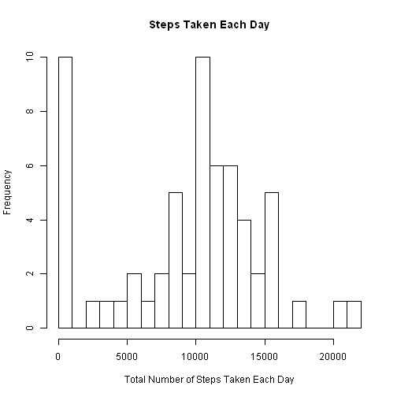
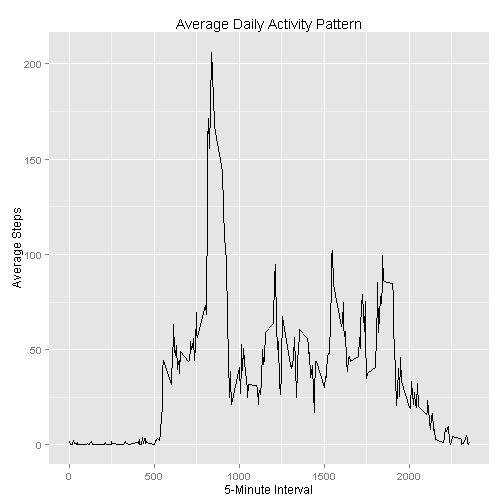
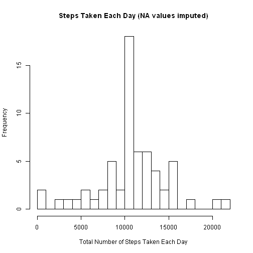
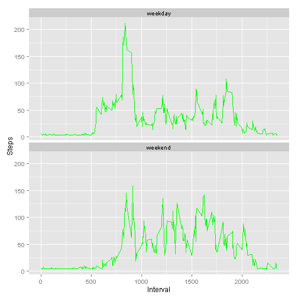

## Dataset

This assignment makes use of data from a personal activity monitoring
device. This device collects data at 5 minute intervals through out the
day. The data consists of two months of data from an anonymous
individual collected during the months of October and November, 2012
and include the number of steps taken in 5 minute intervals each day.

The data for this assignment can be downloaded from the course web
site:

* Dataset: [Activity monitoring data](https://d396qusza40orc.cloudfront.net/repdata%2Fdata%2Factivity.zip) [52K]

The variables included in this dataset are:

* **steps**: Number of steps taking in a 5-minute interval (missing
    values are coded as `NA`)

* **date**: The date on which the measurement was taken in YYYY-MM-DD
    format

* **interval**: Identifier for the 5-minute interval in which
    measurement was taken


## Libraries used


```r
library (plyr)
library(ggplot2)
```

## Loading and preprocessing the data

Asumming the activity,csv file is unzipped into the local directory.


```r
activityData <- read.csv('activity.csv', header = TRUE,
                    colClasses=c("numeric", "character", "numeric"))
```

Convert the date column to a date data type.


```r
activityData$date <- as.Date(activityData$date) 
```

## What is mean total number of steps taken per day?

ddply can subset a data frame, apply a function and then combine results into a data frame.


```r
total_steps_each_day <- ddply (activityData,
                                .(date), 
                                summarize, 
                                totalStepsPerDay=sum (steps, na.rm=TRUE))
```

Show a histogram of the total number of steps taken each day.  Note the outliers at the lower values.


```r
hist(total_steps_each_day$totalStepsPerDay, 
     breaks=20,
     xlab="Total Number of Steps Taken Each Day",
     main="Steps Taken Each Day")
```

 

Mean and median of steps taken each day.


```r
mean(total_steps_each_day$totalStepsPerDay); 
```

```
## [1] 9354.23
```

```r
median(total_steps_each_day$totalStepsPerDay); 
```

```
## [1] 10395
```


## What is the average daily activity pattern?


1.Make a time series plot (i.e. type = "l") of the 5-minute interval (x-axis) and the average number of steps taken, averaged across all days (y-axis)

2.Which 5-minute interval, on average across all the days in the dataset, contains the maximum number of steps?


ddply can subset a data frame, apply a function and then combine results into a data frame.


```r
steps_per_interval <- ddply (activityData,
              .(interval), 
              summarize, 
              averageStepsPerInterval = mean(steps, na.rm=TRUE))
```

Plot


```r
qplot(x=interval, y=averageStepsPerInterval, data = steps_per_interval,  geom = "line",
      xlab="5-Minute Interval",
      ylab="Average Steps",
      main="Average Daily Activity Pattern"
      )
```

 

The interval with the most steps (most active):


```r
steps_per_interval[which.max(steps_per_interval$averageStepsPerInterval), ]
```

```
##     interval averageStepsPerInterval
## 104      835                206.1698
```


## Imputing missing values

### 1. Total number of missing values


```r
missing <- is.na (activityData$steps)
# how many are missing?
sum(missing)
```

```
## [1] 2304
```
### 2. Imputing missing values

Take a copy of the activityData and fill in any missing values with the mean steps for that interval.

There are some intervals with no mean, so in that case use the overall mean across all intervals.


```r
activityImputed <- activityData

activityImputed$steps[missing] <-
  steps_per_interval$averageStepsPerInterval[steps_per_interval$interval == activityImputed$interval[missing]]

activityImputed$steps[is.na (activityImputed$steps)] <- 
  mean (activityData$steps, na.rm=TRUE)
```
  
Show a histogram of the total number of steps taken each day for the Imputed data.  


```r
total_steps_each_dayImp <- ddply (activityImputed,
                                .(date), 
                                summarize, 
                                totalStepsPerDay=sum (steps, na.rm=TRUE))

hist(total_steps_each_dayImp$totalStepsPerDay, 
     breaks=20,
     xlab="Total Number of Steps Taken Each Day",
     main="Steps Taken Each Day (NA values imputed)")
```

 

Note the outliers at the lower values are now gone.


Check the Mean and median of steps taken each day for the Imputed data.


```r
mean(total_steps_each_dayImp$totalStepsPerDay); 
```

```
## [1] 10766.19
```

```r
median(total_steps_each_dayImp$totalStepsPerDay); 
```

```
## [1] 10766.19
```

These values have indeed changed.  Both the mean and the median increased.  This increase makes sense as we are replacing NA values with mean values for the interval (or with the mean for all intervals in some cases mentioned above).


## Are there differences in activity patterns between weekdays and weekends?

Build a daytype variable as a factor to distinguish weekdays from weekend days.


```r
activityImputed$daytype <- weekdays(activityImputed$date)  
for (i in 1:nrow(activityImputed)) {                                       
    if (activityImputed[i,]$daytype %in% c("Saturday","Sunday")) {             
        activityImputed[i,]$daytype <-"weekend"                                 
    }
    else{
        activityImputed[i,]$daytype <-"weekday"                                 
    }
}
```

        

Plotting weekend versus weekday shows definite differences in the activity patterns.  For example, weekend activity starts later in the day.


```r
steps_per_interval <- ddply (activityImputed,
              .(interval, daytype), 
              summarize, 
              averageStepsPerInterval = mean(steps, na.rm=TRUE))


ggplot(steps_per_interval, aes(x=interval, y=averageStepsPerInterval)) + 
        geom_line(color="green") + 
        facet_wrap(~ daytype, nrow=2, ncol=1) +
        labs(x="Interval", y="Steps") +
        theme_gray()
```

 

## Conclusions


There is a difference in pattern between weekend and weekday activity.


